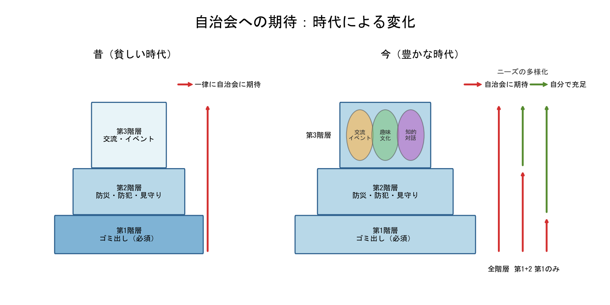

# 年報 第1部 執筆案（Version 2）

**作成日**: 2026年02月14日  
**目的**: 「健康増進の方向」を中心とした新構成  
**位置づけ**: 談話会（3/01）および総会（3/28）配布資料への採用候補  
**執筆メモ**: [annual_report_part1_notes_v1.md](annual_report_part1_notes_v1.md)  
**前バージョン**: [annual_report_part1_draft_v1.md](annual_report_part1_draft_v1.md)

---

## 構成の特徴

**基本方針**：
- 病理（第6班問題）ではなく、健康な構造のビジョンを中心に
- 「どこに向かうか」を明確に示す
- 図の視覚的インパクトを最大化
- セクション4「健康な構造のビジョン」が核心

**5セクション構成**（約1,000字）：
1. 導入（150-200字）
2. 構造の発見（200-250字）- 図が中心
3. 矛盾の具体化（200-250字）
4. **健康な構造のビジョン（200-250字）- 最重要**
5. 展望と問いの共有（150-200字）

---

## ドラフト本文

### 1. 導入

春が来ると、庭の木々は一斉に芽吹きます。でも、よく見ると、それぞれの木が違うタイミング、違う速さで育っています。

自治会も同じかもしれません。112世帯、それぞれの家庭に、それぞれの事情があります。

昨年度、私たちは会費改定について、アンケートを実施しました。冬のアンケートでは、89世帯から回答をいただきました。結果は、三つの選択肢に分かれました。現状維持、簡便性重視、多様化許容。

なぜ、意見が分かれたのでしょうか。

単なる好みの違いではなく、もっと根本的な何かがあるのではないでしょうか。

---

### 2. 構造の発見

よく考えてみると、それぞれの家庭が自治会に「何を求めているか」が、違っているのかもしれません。

話を簡単にするため、自治会への期待を、大きく三つの階層に分けて考えてみます。

**[図：自治会への期待の変化]**

**第一の階層**は、生活必需のこと。ゴミを捨てられること。これは誰にとっても必要で、選択の余地はありません。

**第二の階層**は、安全や安心。防災、防犯、見守り。これも大切ですが、どこまで期待するかは、人によって少し違います。

**第三の階層**は、充実した生活。交流イベント、趣味の活動、対話の場。図の右側を見ると、この階層は内部が多様化しています。人によって、価値の感じ方が大きく異なります。

この図が示すのは、「昔」と「今」の違いです。時代とともに、特に第三の階層が多様化してきました。これは、社会が豊かになった結果でもあります。

---

### 3. 矛盾の具体化

では、現在の自治会の仕組みはどうなっているでしょうか。

正会員であれば、年額3,600円で、すべての階層のサービスを利用できます。そして、役員として活動に参加する義務があります。

ここで、第一の階層（ゴミ）だけを必要とする家庭を考えてみましょう。このような家庭を「Aタイプ」と呼ぶことにします。Aタイプは、第二・第三の階層を、自分で充足できる家庭です。貧しいからではなく、豊かさゆえに自立している家庭です。

Aタイプには、次の二つの選択肢しかありません。

**選択肢１**：第二、第三の階層は不要なのに、セット販売なので、全サービスを買う（不要なものを買う無駄）

**選択肢２**：年額12,000円を払って、第一の階層だけを買う（必要なものだけなのに懲罰的に高い）

どちらの選択も、おかしくないでしょうか。

一方、すべての階層を期待する家庭（「Cタイプ」と呼びます）にとっては、現状の仕組みは自然です。しかし、無意識のうちに、Aタイプの家庭に、不要な第二・第三の階層を強要していないでしょうか。

これは、誰か個人が悪いのではありません。時代が変わり、期待が多様化しているのに、仕組みが追いついていない。そういう構造的な問題です。

---

### 4. 健康な構造のビジョン

では、どこに向かえばよいのでしょうか。

多様化を許容するということは、単に選択肢を増やすことではありません。**自治会の役割を見直すこと**です。

ひとつの考え方として、こんなビジョンがあります。

**第一の階層と第二の階層**は、自治会がしっかりと担う領域です。ゴミ出し、防災、見守り。これらは、地域として取り組むべき大切なことです。

**第三の階層**は、自治会が「場や機会を提供する」けれど、「義務ではない」領域です。図の右側で見たように、第三の階層は内部が多様化しています。交流イベント、趣味の活動、知的な対話。これらは、すべての人に一律に提供できるものではありません。関心のある人が、自由に参加できる。そういう位置づけです。

このように考えると、健康な自治会の姿が見えてきます。

- **Aタイプの家庭**：第一の階層だけを、適正な価格で利用できる
- **Bタイプの家庭**：第一と第二の階層を、安心して利用できる
- **Cタイプの家庭**：すべての階層を、義務ではなく楽しみとして参加できる

それぞれの家庭が、自分のペースで参加できる。役員の負担も、第一・第二の階層に集中できるため、軽減されます。

「減らす」ことで「充実する」。これが、持続可能な自治会への道かもしれません。

---

### 5. 展望と問いの共有

今年度、役員会では、こうした考え方をもとに、新しい選択肢を検討してきました。たとえば、「賛助会員」という仕組み。これは、まだ提案の段階です。

私たちには、まだ答えが見つかっていません。

でも、この年報で共有したかったのは、答えではなく、**問いの前提**です。

会費をどうするか、役員をどうするかを議論する前に、「自治会に何を求めるか」が、それぞれ違うかもしれない。そのことを、まず一緒に考えることが、建設的な議論の第一歩ではないでしょうか。

自治会は、112世帯の共同体です。それぞれの家庭に、それぞれの事情があります。

これからも、一緒に考えていきたいと思います。どうすれば、誰もが自分らしく参加でき、同時に、必要な助け合いができるのか。

春の木々のように、それぞれのペースで、それぞれの豊かさを。

---

## 執筆メモ（このドラフトについて）

### v1からの主な変更点

1. **セクション4「健康な構造のビジョン」を新設**：
   - これが本文の核心
   - 「どこに向かうか」を明確に提示
   - A・B・Cタイプが共存する具体的イメージ

2. **第6班問題を削除**：
   - 病理に引きずられないため
   - 健康増進の方向を優先

3. **図の位置づけを強化**：
   - セクション2で図を明示的に参照
   - 第3階層の多様化を視覚で理解

4. **トーンの調整**：
   - より前向き、希望的
   - 「減らすことで充実する」というパラドックス

### 次のステップ

- 各セクションの文字数を確認（目標：約1,000字）
- 図の説明文の調整
- v1との比較検討
- 談話会での配布を想定した最終調整

---

**文字数（概算）**：
- セクション1：約180字
- セクション2：約230字
- セクション3：約260字
- セクション4：約280字
- セクション5：約200字
- **合計：約1,150字**

目標の1,000字をやや超過。各セクションでさらに削れる部分を検討する余地あり。
